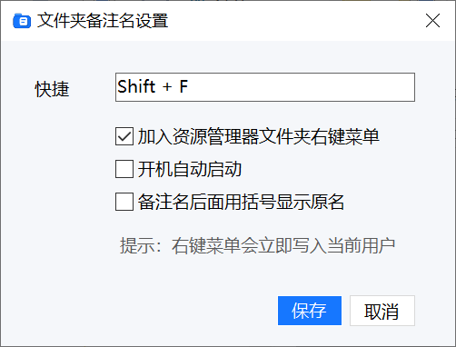

# Folder Remark Name Tool

中文 | [English](#english)

一个 Windows 托盘小工具，用来给资源管理器里的文件夹设置“备注名”。真实文件夹名不变，备注显示名通过 `desktop.ini` 保存。


## 功能

- 在 Windows 资源管理器中选中文件夹后，用快捷键打开备注窗口
- 默认快捷键为 `F4`，也支持在设置中自定义快捷键
- 可同时修改真实文件夹名和备注名
- 可选择显示为 `备注名（原名）`
- 默认加入资源管理器文件夹右键菜单，也支持在设置中移除
- 支持开机自动启动
- 备注写入目标文件夹内的 `desktop.ini`

## 使用说明

1. 启动 `FolderRemarkNameTool.exe`。
2. 在 Windows 资源管理器中选中一个文件夹。
3. 按快捷键，输入备注名并保存。
4. 也可以右键文件夹，选择“设置文件夹备注名”。

## 设置

托盘图标右键选择“设置”，可以修改：

- 快捷键
- 是否加入资源管理器文件夹右键菜单
- 是否开机自动启动
- 是否在备注名后面用括号显示原名



## 实现说明

Windows 资源管理器没有开放“显示名”和“真实文件夹名”完全分离的普通插件接口。本工具使用 Windows Shell 支持的 `desktop.ini` 机制写入显示名。

单独的 `F4` 默认会被资源管理器用于地址栏/导航栏，因此本工具对 `F4` 使用轻量键盘钩子，只在资源管理器前台时处理。带修饰键的组合快捷键使用 `RegisterHotKey`。

## 限制

- 仅支持 Windows。
- 仅处理文件夹，不处理普通文件。
- 某些受保护目录可能需要更高权限才能写入 `desktop.ini`。
- Windows 可能缓存图标或显示名，必要时需要刷新或重启 Explorer。

## 构建

需要 .NET 6 Windows Desktop SDK。

```powershell
dotnet build .\FolderRemarkNameTool.csproj -c Release -p:Platform=x64
```

发布示例：

```powershell
dotnet publish .\FolderRemarkNameTool.csproj -c Release -p:Platform=x64
```

## 开源许可

本项目为个人开源项目，允许个人学习、研究、修改和非商业使用，禁止任何商业用途。详见 [LICENSE](LICENSE)。

---

## English

[中文](#folder-remark-name-tool) | English

A small Windows tray utility for assigning a remark display name to folders in File Explorer. The real folder name stays unchanged, while the display name is stored through `desktop.ini`.


## Features

- Open the remark dialog from File Explorer with a keyboard shortcut
- Default shortcut is `F4`; custom shortcuts are supported in settings
- Edit both the real folder name and the remark name
- Optional display format: `Remark name (Original name)`
- Explorer folder context menu enabled by default, removable from settings
- Optional startup on Windows login
- Stores remarks in the target folder's `desktop.ini`

## Usage

1. Start `FolderRemarkNameTool.exe`.
2. Select a folder in Windows File Explorer.
3. Press the configured shortcut, enter a remark name, and save.
4. You can also right-click a folder and choose "Set folder remark name".

## Settings

Right-click the tray icon and choose "Settings" to configure:

- Keyboard shortcut
- Explorer folder context menu
- Start with Windows
- Show original name in parentheses after the remark name


## How It Works

Windows File Explorer does not provide a normal plugin API that fully separates a folder's display name from its real filesystem name. This tool uses the Windows Shell `desktop.ini` mechanism to write the display name.

Plain `F4` is commonly used by File Explorer for the address/navigation bar, so this tool handles it with a lightweight keyboard hook only when File Explorer is in the foreground. Shortcuts with modifier keys use `RegisterHotKey`.

## Limitations

- Windows only.
- Folders only; regular files are not supported.
- Protected folders may require elevated permissions to write `desktop.ini`.
- Windows may cache icons or display names, so Explorer refresh or restart may be required in some cases.

## Build

.NET 6 Windows Desktop SDK is required.

```powershell
dotnet build .\FolderRemarkNameTool.csproj -c Release -p:Platform=x64
```

Publish example:

```powershell
dotnet publish .\FolderRemarkNameTool.csproj -c Release -p:Platform=x64
```

## License

This is a personal open-source project. Personal learning, research, modification, and non-commercial use are allowed. Commercial use is prohibited. See [LICENSE](LICENSE).
