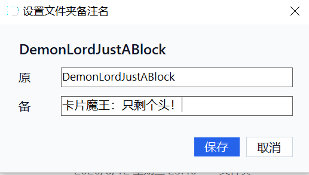
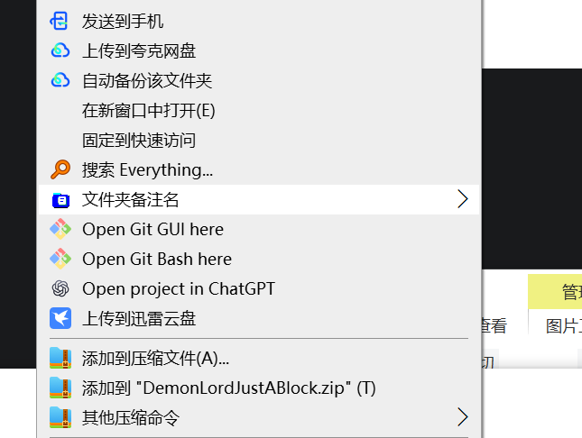

# Folder Remark Name Tool

?? | [English](#english)

?? Windows ??????????????????????????????????????????? `desktop.ini` ???



## ??

- ? Windows ???????????????????????
- ?????? `F4`??????????????
- ???????????????
- ?????? `???????`
- ??????????????????????????
- ????????
- ??????????? `desktop.ini`

## ????

1. ?? `FolderRemarkNameTool.exe`?
2. ? Windows ??????????????
3. ??????????????
4. ??????????????????????



## ??

??????????????????

- ???
- ????????????????
- ????????
- ???????????????


## ????

Windows ???????????????????????????????????????? Windows Shell ??? `desktop.ini` ????????

??? `F4` ??????????????/?????????? `F4` ?????????????????????????????????? `RegisterHotKey`?

## ??

- ??? Windows?
- ???????????????
- ??????????????????? `desktop.ini`?
- Windows ????????????????????? Explorer?

## ??

?? .NET 6 Windows Desktop SDK?

```powershell
dotnet build .\FolderRemarkNameTool.csproj -c Release -p:Platform=x64
```

?????

```powershell
dotnet publish .\FolderRemarkNameTool.csproj -c Release -p:Platform=x64
```

## ????

????????????????????????????????????????? [LICENSE](LICENSE)?

---

## English

[??](#folder-remark-name-tool) | English

A small Windows tray utility for assigning a remark display name to folders in File Explorer. The real folder name stays unchanged, while the display name is stored through `desktop.ini`.


## Features

- Open the remark dialog from File Explorer with a keyboard shortcut
- Default shortcut is `F4`; custom shortcuts are supported in settings
- Edit both the real folder name and the remark name
- Optional display format: `Remark name (Original name)`
- Explorer folder context menu enabled by default, removable from settings
- Optional startup on Windows login
- Stores remarks in the target folder's `desktop.ini`

## Usage

1. Start `FolderRemarkNameTool.exe`.
2. Select a folder in Windows File Explorer.
3. Press the configured shortcut, enter a remark name, and save.
4. You can also right-click a folder and choose "Set folder remark name".


## Settings

Right-click the tray icon and choose "Settings" to configure:

- Keyboard shortcut
- Explorer folder context menu
- Start with Windows
- Show original name in parentheses after the remark name


## How It Works

Windows File Explorer does not provide a normal plugin API that fully separates a folder's display name from its real filesystem name. This tool uses the Windows Shell `desktop.ini` mechanism to write the display name.

Plain `F4` is commonly used by File Explorer for the address/navigation bar, so this tool handles it with a lightweight keyboard hook only when File Explorer is in the foreground. Shortcuts with modifier keys use `RegisterHotKey`.

## Limitations

- Windows only.
- Folders only; regular files are not supported.
- Protected folders may require elevated permissions to write `desktop.ini`.
- Windows may cache icons or display names, so Explorer refresh or restart may be required in some cases.

## Build

.NET 6 Windows Desktop SDK is required.

```powershell
dotnet build .\FolderRemarkNameTool.csproj -c Release -p:Platform=x64
```

Publish example:

```powershell
dotnet publish .\FolderRemarkNameTool.csproj -c Release -p:Platform=x64
```

## License

This is a personal open-source project. Personal learning, research, modification, and non-commercial use are allowed. Commercial use is prohibited. See [LICENSE](LICENSE).
